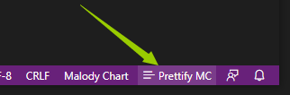
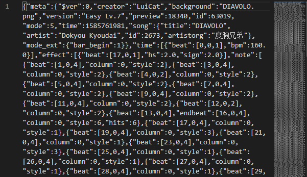
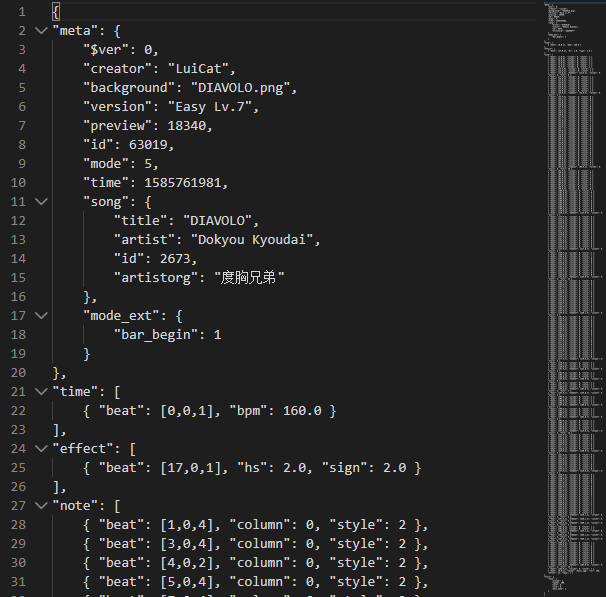

# Malody Prettify

Adds language support for Malody's chart format .mc with prettify function.

## Features

Malody make use of JSON format for charts. By default, the JSON contents are uglified.

This plugin prettify the chart file in a better way, such that notes and effects will have all their properties on the same line.

## Release Notes

### 0.0.1

Initial release

## Credits

[JSON Pretty Printer](https://marketplace.visualstudio.com/items?itemName=euskadi31.json-pretty-printer), [source code on GitHub](https://github.com/euskadi31/vscode-json-pretty-printer)
